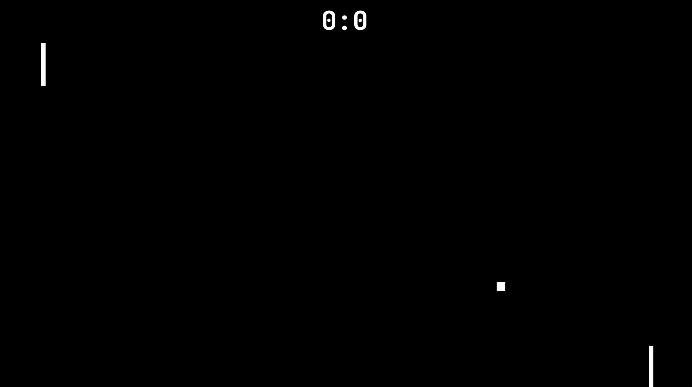

# (almost) Pong



The classic ping pong game with a catch: the ball gets faster after every bounce. Be quick!  
The left player controls with 'up' and 'down' arrows, while the right player uses 'left' and 'right' arrows.  

## Installation (linux only)
 
### Dependency

SFML library.

```
sudo apt-get install libsfml-dev
```

### Build

`cd` to the project directory and run:

```
g++ -c main.cpp
g++ main.o -o pingpong -lsfml-graphics -lsfml-audio -lsfml-window -lsfml-system
./pingpong
```