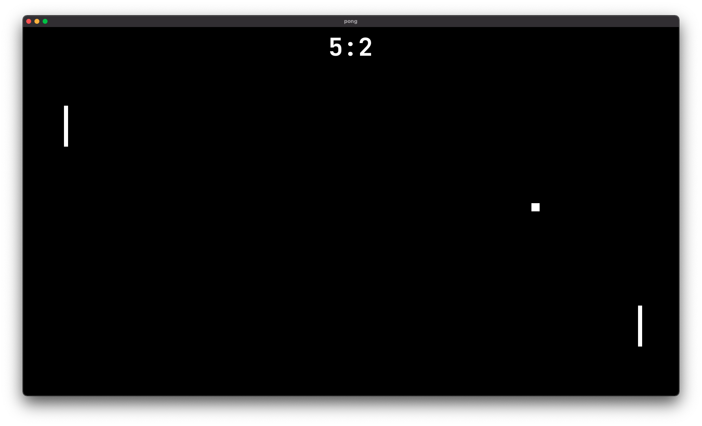

# (almost) Pong



The classic ping pong game with a catch: the ball gets faster after every bounce. Be quick!

## Dependencies

SFML library

ubuntu
```
sudo apt-get install libsfml-dev
```
macOs
```
brew install sfml
```

### Build

- Download the entire project (including the assets)
- `cd` to the project directory
- Now let's compile and build it:

```
g++ -c main.cpp
g++ main.o -o pingpong -lsfml-graphics -lsfml-window -lsfml-system
./sfml-app
```
